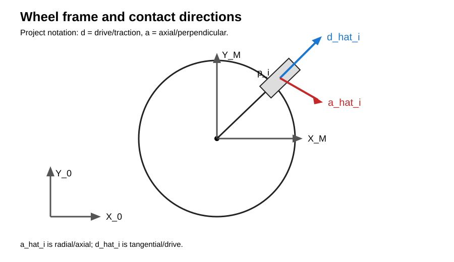
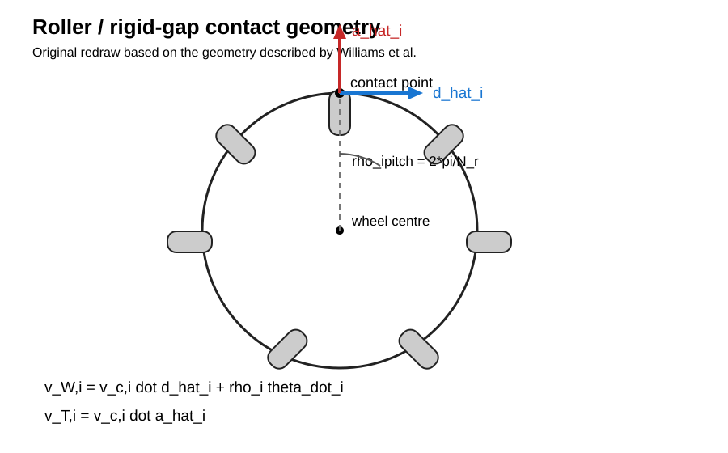

# Omni-Wheel Slip / Roller-Gap Physics Model

## Purpose

This document defines the physics model used by the Python plant model for the MPC project.

The model is based on:

> R. L. Williams II, B. E. Carter, P. Gallina, and G. Rosati, "Dynamic Model with Slip for Wheeled Omni-Directional Robots," IEEE Transactions on Robotics and Automation, vol. 18, no. 3, pp. 285-293, 2002.

The Williams paper derives a planar rigid-body dynamics model with wheel/ground slip and then improves it by making the friction coefficients depend on the instantaneous wheel angle. The important physical observation is that the rigid material between omni-wheel rollers can contact the ground and has substantially different friction from the rollers.

The paper experimentally validated this improved model against both static force-to-slip measurements and robot trajectory experiments. It used an 8-roller wheel and measured friction coefficients for paper and carpet. Those numerical values are not measurements of our current wheel or SSL field.

Reference: https://people.ohio.edu/williams/html/PDF/IEEETRA02.pdf

---

## 1. Model scope

The model is a planar rigid-body plant with empirical Coulomb-like wheel/ground friction.

It includes:

- robot translation in the plane;
- robot yaw;
- wheel-center velocity caused by robot translation and yaw;
- commanded/measured wheel angular velocity;
- longitudinal wheel slip;
- transverse wheel slip;
- different friction coefficients for roller contact and rigid-gap contact;
- periodic switching between roller and gap contact as each wheel rotates;
- the resulting force and yaw torque on the robot.

It deliberately does not model:

- individual passive roller angular velocities;
- passive roller inertia;
- bearing friction inside each roller;
- motor electrical dynamics;
- motor torque/current dynamics;
- detailed rubber deformation;
- carpet deformation;
- suspension compliance;
- transient normal-force redistribution;
- separate static and kinetic friction coefficients;
- stiction/hysteresis.

These omissions are model assumptions, not accidental missing equations. Williams also used a deliberately simplified friction law and explicitly noted that more detailed friction models could improve the model.

---

> **Project notation:** Williams et al. use $\hat r_i$ for the wheel axle direction and $\hat s_i$ for the wheel drive direction. This project uses $\hat a_i$ for the **axial/perpendicular** direction and $\hat d_i$ for the **drive/traction** direction. This is only a notation change; the physical model is unchanged.
>
> \[\hat{\mathbf a}_i\equiv\hat{\mathbf r}_i^{\mathrm{Williams}},\qquad \hat{\mathbf d}_i\equiv\hat{\mathbf s}_i^{\mathrm{Williams}}\]
>
# 2. Coordinate systems and wheel geometry

Let the robot state be

$$
\mathbf{x}
=
\begin{bmatrix}
x & y & \phi & V_x & V_y & \omega &
\theta_1 & \cdots & \theta_N
\end{bmatrix}^T .
$$

where:

- $x,y$ are the robot center-of-mass position in the inertial frame;
- $\phi$ is robot yaw;
- $V_x,V_y$ are center-of-mass translational velocities in the inertial frame;
- $\omega = \dot\phi$ is yaw rate;
- $\theta_i$ is the rotation angle of wheel $i$;
- $N=4$ for the current robot.

For wheel $i$, define:

- $\mathbf{p}_i$: vector from robot center to wheel center;
- $\hat{\mathbf a}_i$: axial/perpendicular direction;
- $\hat{\mathbf d}_i$: wheel drive/rotation direction.

The body-frame vectors are rotated into the inertial frame by

$$
\mathbf{R}(\phi)
=
\begin{bmatrix}
\cos\phi & -\sin\phi \\
\sin\phi & \cos\phi
\end{bmatrix}.
$$

Therefore,

$$
\mathbf p_i = \mathbf R(\phi)\mathbf p_{i,M},
$$

$$
\hat{\mathbf d}_i = \mathbf R(\phi)\hat{\mathbf d}_{i,M},
$$

$$
\hat{\mathbf a}_i = \mathbf R(\phi)\hat{\mathbf a}_{i,M}.
$$

For the current wheel arrangement, the wheel axle points radially from the robot center and the drive direction is tangential to that radius.

---

## Geometry diagrams

These are original redrawings of the relevant Williams geometry using this project's $\hat d/\hat a$ notation. The original paper is linked for comparison.

Original reference: [Williams et al. (2002)](https://people.ohio.edu/williams/html/PDF/IEEETRA02.pdf)

# 3. Contact-point kinematics

The velocity of the wheel/ground contact point due to robot-body motion is

$$
\mathbf v_{c,i}
=
\mathbf V_G
+
\boldsymbol\omega \times \mathbf p_i
$$

where

$$
\mathbf V_G =
\begin{bmatrix}
V_x\\V_y
\end{bmatrix},
\qquad
\boldsymbol\omega =
\begin{bmatrix}
0\\0\\\omega
\end{bmatrix}.
$$

In 2-D,

$$
\boldsymbol\omega \times \mathbf p_i
=
\begin{bmatrix}
-\omega p_{i,y}\\
\omega p_{i,x}
\end{bmatrix}.
$$

This is the velocity of the wheel center/contact location caused by robot motion before adding the driven wheel's peripheral velocity.

---

# 4. Wheel peripheral velocity

The wheel angular velocity is

$$
\boldsymbol{\omega}_i
=
\dot\theta_i\hat{\mathbf a}_i.
$$

Williams expresses the peripheral contact velocity using

$$
\mathbf v_{r,i}
=
\boldsymbol{\omega}_i \times \boldsymbol\rho_i
$$

where $\boldsymbol\rho_i$ is the wheel-center-to-contact radius vector.

With the sign convention used in this project, this peripheral velocity is represented as

$$
\mathbf v_{r,i}
=
\rho_i\dot\theta_i\hat{\mathbf d}_i.
$$

The exact sign depends on the chosen positive wheel-angle and $\hat{\mathbf d}_i$ conventions. What matters is that the convention is used consistently in both inverse kinematics and the slip equation below.

---

# 5. Longitudinal and transverse slip

The longitudinal slip velocity is the component of the total contact velocity in the wheel-drive direction:

$$
v_{W,i}
=
\mathbf v_{c,i}\cdot\hat{\mathbf d}_i
+
\rho_i\dot\theta_i.
$$

This is the convention currently used by the Python plant model.

The transverse slip velocity is

$$
v_{T,i}
=
\mathbf v_{c,i}\cdot\hat{\mathbf a}_i.
$$

There is no $\dot\theta_i$ term in $v_{T,i}$ because wheel rotation produces peripheral velocity along $\hat{\mathbf d}_i$, not along the axle direction $\hat{\mathbf a}_i$.

These are the two slip velocities that drive the friction model.

---

# 6. Friction coefficient model

Williams uses a smooth approximation to Coulomb friction:

$$
\mu(v)
=
\mu_{\max}
\frac{2}{\pi}
\tan^{-1}(kv).
$$

The coefficient has the same sign as the slip velocity.

The resulting friction force is opposite the slip velocity.

The parameter $k$ controls how rapidly the function approaches the Coulomb limit. Williams used

$$
k=1000
$$

and selected it for numerical stability in Simulink.

This is a numerical approximation to Coulomb friction, not a claim that real carpet friction literally follows an arctangent law.

---

# 7. Roller and rigid-gap contact

The wheel does not present the same material to the ground at every wheel angle.

For each roller pitch,

$$
\Delta\theta_{\mathrm{pitch}}
=
\frac{2\pi}{N_r},
$$

where $N_r$ is the number of rollers.

For our current wheel,

$$
N_r=16
$$

so

$$
\Delta\theta_{\mathrm{pitch}}
=
\frac{2\pi}{16}
=
22.5^\circ.
$$

Each pitch is divided into:

1. a roller-contact region;
2. a rigid-material gap region.

Let

$$
f_r
=
\frac{\Delta\theta_{\mathrm{roller}}}
{\Delta\theta_{\mathrm{pitch}}}
$$

be the fraction of each pitch occupied by the roller-contact region.

Then the friction coefficients are selected according to wheel angle.

### Roller contact

$$
\mu_W = \mu'_W(v_W),
\qquad
\mu_T = \mu'_T(v_T).
$$

### Rigid gap contact

$$
\mu_W = \mu''_W(v_W),
\qquad
\mu_T = \mu''_T(v_T).
$$

Williams measured, for their carpet surface:

$$
\mu'_W = 0.25,
\qquad
\mu'_T = 0.15,
$$

and

$$
\mu''_W = \mu''_T = 0.56.
$$

These values are reference values only. They were measured on the authors' wheel and carpet and must not be treated as the friction coefficients of our robot.

The key physical result from the paper is that the rigid material between rollers has much larger transverse friction than the rollers themselves. This periodic change is what produces the additional slip behaviour in their improved model.

---

# 8. Current wheel geometry

The current wheel measurements are:

$$
D_{\mathrm{inner}} = 31.04270\;\mathrm{mm}
$$

$$
D_{\mathrm{outer}} = 59.82900\;\mathrm{mm}.
$$

The roller diameter is derived from the difference between these two diameters:

$$
D_{roller}
=
\frac{
D_{\mathrm{outer}}-D_{\mathrm{inner}}
}{2}
$$

giving

$$
\boxed{
D_{roller}=14.39315\;\mathrm{mm}
}
$$

and therefore

$$
\boxed{
R_{roller}=7.196575\;\mathrm{mm}
}.
$$

The measured minimum gap is

$$
g_{min}=3.06464\;\mathrm{mm}.
$$

The measured gap at the roller center is

$$
g_{center}=5.59634\;\mathrm{mm}.
$$

Importantly, $5.59634$ mm is not the ground-contact gap.

For the current geometric approximation, the gap is extrapolated from the minimum-gap location through the roller center to the ground-contact radius:

$$
g_{floor}
=
g_{center}
+
(g_{center}-g_{min})
$$

so

$$
\boxed{
g_{floor}=8.12804\;\mathrm{mm}
}.
$$

This extrapolation is a project-specific geometric assumption. It should eventually be checked against CAD or a direct physical measurement.

The wheel ground-contact radius currently used by the model is

$$
\rho=29.915\;\mathrm{mm}.
$$

If the measured floor gap is interpreted as the chord separating adjacent roller-contact regions at that radius, its corresponding angular width is

$$
\Delta\theta_{gap}
=
2\sin^{-1}
\left(
\frac{g_{floor}}{2\rho}
\right)
$$

which gives

$$
\boxed{
\Delta\theta_{gap}=15.6158^\circ
}.
$$

Therefore,

$$
\Delta\theta_{roller}
=
22.5^\circ-15.6158^\circ
=
6.8842^\circ
$$

and

$$
\boxed{
f_r=0.305964
}.
$$

This value is currently a geometric estimate, not an experimentally validated contact fraction.

---

# 9. Wheel force

Let $N_i$ be the normal load on wheel $i$.

The Williams friction force is

$$
\boxed{
\mathbf F_i
=
-N_i
\left[
\mu_W(v_{W,i})\hat{\mathbf d}_i
+
\mu_T(v_{T,i})\hat{\mathbf a}_i
\right]
}
$$

The negative sign is essential: friction opposes the corresponding slip velocity.

For the current implementation, the normal load is assumed to be equally distributed:

$$
N_i
=
\frac{mg}{N}.
$$

For four wheels,

$$
N_i=\frac{mg}{4}.
$$

This is a modelling assumption. It is not exact under arbitrary acceleration or if the center of mass is not exactly centered.

---

# 10. Robot translational and rotational dynamics

The total ground force is

$$
\mathbf F
=
\sum_{i=1}^{N}\mathbf F_i.
$$

The translational dynamics are

$$
m\dot{\mathbf V}_G
=
\sum_{i=1}^{N}\mathbf F_i.
$$

Equivalently,

$$
\boxed{
\dot V_x
=
\frac{1}{m}
\sum_i F_{i,x}
}
$$

and

$$
\boxed{
\dot V_y
=
\frac{1}{m}
\sum_i F_{i,y}.
}
$$

The yaw dynamics are

$$
I_z\dot\omega
=
\sum_{i=1}^{N}
(\mathbf p_i\times\mathbf F_i)_z.
$$

Therefore,

$$
\boxed{
\dot\omega
=
\frac{1}{I_z}
\sum_i
\left(
p_{i,x}F_{i,y}
-
p_{i,y}F_{i,x}
\right).
}
$$

The kinematic state equations are

$$
\dot x=V_x,
\qquad
\dot y=V_y,
\qquad
\dot\phi=\omega.
$$

---

# 11. Wheel-angle state

The roller/gap regime depends on the wheel's instantaneous angle, so each wheel needs a phase state:

$$
\boxed{
\dot\theta_i=u_i
}
$$

where the current Python implementation treats

$$
u_i=\dot\theta_i
$$

as the wheel angular-velocity input.

The phase within one roller pitch is

$$
\theta_{phase,i}
=
\operatorname{mod}
\left(
\theta_i-\theta_{0,i},
\frac{2\pi}{N_r}
\right).
$$

The phase offset $\theta_{0,i}$ determines where the physical roller/gap boundary occurs.

The phase offset is currently a calibration/geometry parameter and must be verified.

---

# 12. Complete continuous-time plant

The current intended plant can therefore be written compactly as

$$
\boxed{
\begin{aligned}
\dot x &= V_x \\
\dot y &= V_y \\
\dot\phi &= \omega \\
m\dot V_x &= \sum_i F_{i,x} \\
m\dot V_y &= \sum_i F_{i,y} \\
I_z\dot\omega &= \sum_i
(\mathbf p_i\times\mathbf F_i)_z \\
\dot\theta_i &= u_i
\end{aligned}
}
$$

with

$$
\boxed{
\mathbf F_i
=
-N_i
\left[
\mu_W(v_{W,i})\hat{\mathbf d}_i
+
\mu_T(v_{T,i})\hat{\mathbf a}_i
\right]
}
$$

and

$$
\boxed{
v_{W,i}
=
(\mathbf V_G+\boldsymbol\omega\times\mathbf p_i)
\cdot\hat{\mathbf d}_i
+
\rho_i u_i
}
$$

$$
\boxed{
v_{T,i}
=
(\mathbf V_G+\boldsymbol\omega\times\mathbf p_i)
\cdot\hat{\mathbf a}_i.
}
$$

---

# 13. Is this actually "correct physics"?

## What is well supported

The following structure is directly based on the Williams model:

- rigid-body translational and yaw dynamics;
- contact-point velocity from translation plus rotational motion;
- wheel peripheral velocity;
- longitudinal and transverse slip;
- friction opposing slip;
- smooth Coulomb approximation;
- wheel-angle-dependent friction coefficients;
- separate roller and rigid-gap friction;
- equal-load assumption when the center of mass/load distribution justifies it.

Williams explicitly developed these equations and experimentally showed that adding the rigid-gap friction mechanism substantially improved agreement with measured robot trajectories.

The paper reports, for its own 3-wheel robot, that the improved model predicted a carpet final yaw of about $0.558$ rad, compared with measured values of $0.524$, $0.506$, and $0.489$ rad in three trials. This is useful external evidence that the model structure captures a real effect. It does not validate our 4-wheel implementation or our wheel geometry.

## What is not yet validated for our robot

The following are still unknown or estimated.

### 1. SSL-specific friction coefficients

The official SSL rules specify a green felt mat or carpet over a level, flat, hard floor, but do not provide a numerical coefficient of friction for our wheel material.

Therefore we should not claim that Williams' carpet values are the actual SSL coefficients.

They are useful starting values for simulations, but the final values should be measured.

### 2. Roller/gap fraction

The current 30.5964% roller-contact fraction comes from our measured geometry plus the stated extrapolation.

It is not yet experimentally validated.

### 3. Contact phase

The physical angular location of the roller/gap boundary relative to the encoder zero must be established.

### 4. Normal-force distribution

The current model assumes

$$
N_i=mg/N.
$$

This ignores load transfer and any unequal static loading.

### 5. Wheel/motor dynamics

The current plant treats wheel angular velocity as an input:

$$
u_i=\dot\theta_i.
$$

That is appropriate if the MPC is modelling the robot at the level of commanded/measured wheel speeds.

It is not a complete motor/actuator model.

If the MPC input is motor torque, voltage, current, or PWM duty cycle, motor electrical and mechanical dynamics must be added.

### 6. Static versus dynamic friction

Williams explicitly assumed that their dynamic friction coefficient was equal to the measured static coefficient. They noted that a lower dynamic coefficient could potentially improve the model. This remains an approximation.

### 7. Compliance and carpet deformation

The model treats the wheel and floor as rigid and represents the carpet interaction through empirical friction coefficients. It does not model carpet deformation, roller rubber deformation, or contact-patch mechanics.

---

# 14. What we should NOT add

We should not add a separate angular state and inertia for every passive roller just because that seems more physically detailed.

The Williams model that we are basing this work on does not require that state.

The periodic roller effect comes from the wheel angle selecting between two empirically measured friction regimes:

$$
\text{roller}
\leftrightarrow
\text{rigid gap}.
$$

Adding passive-roller inertia would create a different model that needs its own physical justification and experimental validation.

---

# 15. Validation plan

Visual plots are not sufficient validation.

The Python model should eventually pass the following tests.

## Level 1: mathematical/unit tests

These verify that the implementation actually evaluates the equations correctly.

### Zero slip

If

$$
v_W=v_T=0
$$

then

$$
\mathbf F_i=0.
$$

### Slip reversal

For a fixed $|v|$,

$$
\mathbf F(+v)=-\mathbf F(-v).
$$

### Energy dissipation

The surface must not inject energy through friction.

For each wheel, the instantaneous friction power associated with slip is

$$
P_i
=
-N_i
\left[
\mu_W(v_W)v_W
+
\mu_T(v_T)v_T
\right].
$$

Because the arctangent friction law has the same sign as its argument,

$$
P_i\le0.
$$

This is a particularly useful automated physics test.

### Symmetry

Mirror-symmetric wheel configurations and mirrored motions should produce mirrored forces and trajectories.

### Zero yaw torque for symmetric pure translation

For a symmetric wheel arrangement, a suitable pure translation test should produce the expected cancellation of yaw torque.

### Roller/gap transition

At the same slip velocity, switching from roller to rigid-gap contact should change the force according to the selected coefficient set.

---

# 16. Level 2: external published-model validation

The Williams paper provides an independent benchmark.

Their improved model produced:

- approximately 53 mm shortfall in x for the paper case;
- approximately -22 mm y drift;
- approximately -0.111 rad final yaw for the paper case;
- approximately 0.558 rad final yaw for their carpet case;
- measured carpet final yaw values of approximately 0.524, 0.506, and 0.489 rad.

A future test should reconstruct their 3-wheel geometry, mass, inertia, wheel radius, wheel angles, friction coefficients, roller/gap fraction, and commanded wheel speeds, then compare our Python implementation against those published results.

This is a test of the implementation against an external reference, not a test of our SSL robot.

---

# 17. Level 3: physical validation on our robot

The strongest validation for this project is experimental.

For controlled tests, record:

- commanded wheel angular velocities;
- measured wheel angular velocities;
- robot pose from SSL-Vision or another external measurement system;
- robot velocity;
- robot yaw rate;
- test surface;
- robot mass;
- wheel geometry.

Then compare:

$$
\text{measured trajectory}
\quad\text{vs.}\quad
\text{Python plant prediction}.
$$

The friction parameters should be identified from one subset of experiments and evaluated on separate experiments.

Do not fit and evaluate on the same trajectory and call the result validation.

---

# 18. Level 4: Python/C++ cross-validation

The Python plant and the C++ simulator should eventually be given exactly the same:

- robot geometry;
- initial state;
- wheel inputs;
- friction coefficients;
- roller/gap fraction;
- integration timestep;
- model equations.

Then their numerical outputs should agree within a defined tolerance.

This catches implementation differences between the MPC plant and the simulator.

The Python implementation is the model that the MPC should use. The C++ simulator should independently reproduce the same equations.

---

# 19. Current model status

| Item | Status |
|---|---|
| Rigid-body equations | **Implemented** |
| Contact-point kinematics | **Implemented** |
| Longitudinal slip | **Implemented** |
| Transverse slip | **Implemented** |
| Smooth Coulomb friction | **Implemented** |
| Roller/gap switching | **Implemented** |
| 16-roller pitch | **Specified** |
| Roller diameter | **Measured/derived** |
| Roller radius | **Measured/derived** |
| Gap extrapolation | **Estimated from measurements** |
| Roller-contact fraction | **Derived estimate** |
| Wheel phase offset | **Needs verification** |
| SSL friction coefficients | **Not measured** |
| Dynamic normal loads | **Not modelled** |
| Motor dynamics | **Not modelled** |
| Carpet deformation | **Not modelled** |
| Static/dynamic friction distinction | **Not modelled** |
| Unit tests | **Started** |
| Published Williams benchmark | **Not yet reproduced** |
| Real-robot validation | **Not yet performed** |
| Python/C++ cross-validation | **Not yet performed** |

## Bottom line

The core equations are physically defensible and faithfully based on the published Williams model, but the current Python file should not yet be described as a fully validated physical model of our SSL robot.

The biggest missing pieces are not more complicated roller dynamics. They are **measured friction coefficients, verified roller/gap geometry and phase, and experimental validation against our actual robot**.

The model becomes useful for MPC once those parameters are identified and the implementation passes the mathematical, external-reference, and real-robot validation tests above.
